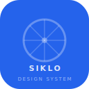

<p align="center">
  
</p>

<h1 align="center">Siklo Design System</h1>

<p align="center">
  A production-grade React component library built on Radix UI primitives, powered by design tokens, documented in Storybook, and fully tested.
</p>

---

## Tech Stack

| Tool                  | Role                                      |
| --------------------- | ----------------------------------------- |
| React 19              | UI framework                              |
| TypeScript            | Type safety across components and tokens  |
| Radix UI              | Headless, accessible component primitives |
| Style Dictionary      | Design token transformation pipeline      |
| Storybook 10          | Component documentation and controls      |
| Vitest                | Unit and component test runner            |
| React Testing Library | DOM-based component testing               |
| CSS Modules           | Scoped, token-driven component styles     |

## Architecture

```
Figma (Tokens Studio)
        |
   JSON Export (DTCG spec)
        |
   Style Dictionary
        |
CSS Variables + TS Constants
        |
   React Components (Radix UI + CSS Modules)
        |
   Storybook (docs, a11y, controls)
        |
   Vitest + React Testing Library
```

## Components

| Component  | Description                                          | Status |
| ---------- | ---------------------------------------------------- | ------ |
| Button     | Primary actions with variants, sizes, loading, icons | Stable |
| Dialog     | Modal with focus trapping and animations             | Stable |
| Select     | Keyboard-navigable dropdown                          | Stable |
| Tooltip    | Accessible tooltip with placement options            | Stable |
| Toast      | Notification system with imperative API              | Stable |
| InputField | Form field with label, helper text, and error states | Stable |

## Getting Started

```bash
# Install dependencies
npm install

# Build design tokens
npm run build:tokens

# Start Storybook
npm run storybook

# Run tests
npm run test
```

## Design Principles

- **Accessible by default** — every component is keyboard navigable and screen-reader friendly
- **Token-driven** — no hardcoded values; all styles reference design tokens
- **Composable** — built on Radix primitives for maximum flexibility
- **Tested** — behavior-driven tests with React Testing Library

## Token Pipeline

```
Figma (Tokens Studio) → JSON Export → Style Dictionary → CSS Variables + TS Constants → Components → Storybook
```

Tokens are defined in Figma using Tokens Studio, exported as JSON following the DTCG spec, and transformed by Style Dictionary into CSS custom properties and TypeScript constants consumed by every component.

## Scripts

| Script                    | Description                          |
| ------------------------- | ------------------------------------ |
| `npm run build:tokens`    | Transform design tokens to CSS + TS  |
| `npm run storybook`       | Launch Storybook dev server          |
| `npm run build-storybook` | Build Storybook for production       |
| `npm run test`            | Run all tests                        |
| `npm run test:watch`      | Run tests in watch mode              |
| `npm run build`           | Full pipeline: tokens + test + build |

## License

MIT
